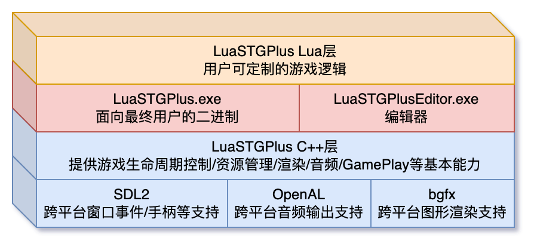

# LuaSTGPlus

## 项目简介

`LuaSTG`是一个用`lua`脚本语言驱动游戏逻辑的类东方弹幕射击游戏开发框架。最早由`隔壁的桌子`于2012年前后开发，其源码不慎遗失。

`LuaSTGPlus`项目在保证接口功能兼容的前提下重新开发了`LuaSTG`底层框架代码。项目致力于发展`LuaSTG`的后续可维护版本，以优化和完善接口设计和框架功能、适应现代游戏开发要求为目标。

`LuaSTGPlus`的上一个版本基于不再维护的底层框架进行开发，年久失修，目前不再继续维护。

`v2`版本将基于常见开源库重新打造底层框架，致力于提供跨平台的弹幕射击游戏解决方案，并提供长线可维护能力。

## TODO
- [x] 渲染问题修复
- [x] 碰撞检测支持
- [x] 曲线激光支持
    - 待测试
- [x] RT & PostEffect 支持
- [x] 鼠标输入事件
- [x] 截图支持
- [x] Profile 数据 & Debug 界面调整
- [x] ~~内存泄漏 BUG 修复~~
- [x] WebASM 调优
  - [x] SRGB 处理
- [x] DX12 接入
  - [ ] ~~HiDPI支持~~
- [x] Linux
  - [x] Ubuntu / X11
  - [x] 树莓派接入(Vulkan Only)
- [x] 命令行参数机制优化
  - [x] preload-pack=xxx
  - [x] enable-async-loading
  - [x] graphics=d3d11/d3d12/vulkan/opengl
  - [x] force-fullscreen
  - [x] render-frame-skip
  - [x] controller-to-key-config
- [x] 手柄 -> 键盘按键映射器
- [x] Building patch
  - [x] Diligent 构建 patch under wasm
  - [x] Diligent/Vulkan 不选择集显
  - [x] SDL2 CMake patch
- [ ] 音频系统
- [ ] Windows 图标修复
- [ ] 开源准备
  - [ ] License 补全
  - [ ] 文档补全
  - [ ] Windows 图标
- [ ] 其他分支API支持
  - [ ] 自定义RT大小
  - [ ] 三参数Dist Angle支持
  - Reference: https://github.com/Legacy-LuaSTG-Engine/LuaSTG-Sub-Documentation
- [ ] 实验性v2 API暴露
    - [ ] DrawGroup
    - [ ] 异步加载控制API
    - [ ] 多世界支持API
    - [ ] VS/PS Shader支持API
    - [ ] 自定义Mesh支持API
    - [ ] 自定义文字渲染（排版）
    - [ ] 相对路径资源加载
- [ ] Data重写
