# 概述

LSTGPlus 提供两套 API，分为`Legacy API`和`Advanced API`。

其中，`Legacy API`包含所有 LSTG 中出现的老 API。`Advanced API`提供了核心引擎中更加底层的扩展功能支持。

为了方便描述，我们采取类似 typescript 的语法对接口类型进行说明。

## 程序生命周期

## 全局回调方法

### GameInit

在游戏框架初始化完毕后，游戏循环启动前调用。

- 签名：`GameInit()`

### FocusLoseFunc

在渲染窗口失去焦点时调用。

- 签名：`FocusLoseFunc()`

### FocusGainFunc

在渲染窗口获得焦点时调用。

- 签名：`FocusGainFunc`

### FrameFunc():boolean

帧处理函数，每帧被调用来处理逻辑。

- 签名：`FrameFunc(): boolean`
- 返回值：true 用于终止循环，退出程序。

### RenderFunc

渲染处理函数，每帧被调用时用来渲染场景。

- 签名：`RenderFunc()`
