# 音频子系统

::: warning TODO
本段描述的特性可能尚未完全暴露在 API 中。
:::

LSTGPlus 的音频系统主要面向 2D 游戏设计，因此不具备复杂的 3D 空间音频功能。

音频总线工作在`44100 Hz`采样率、立体声、`32bit float`量化格式下，所有音频数据在经过总线处理前都会转换为该格式。

在多线程可用环境下，音频处理会工作在单独的线程上，以防止对游戏主线程的影响。在多线程不可用环境下（如`emscripten`），将会在帧更新中同步进行音频处理。

## 基本概念

### 音频数据

音频数据用于表示可供播放的 PCM 波形数据，当前支持从下述文件类型中加载波形数据：

- wav
- aiff
- au
- voc
- flac
- ogg/vorbis
- raw
- shn
- mp3

存储上，LSTGPlus 中具有两种类型：`缓冲区式`、`流式`。对于缓冲区式数据，LSTGPlus 会预先解码所有数据并存储到缓冲区中，由于我们内部使用的音频数据格式采取浮点数存储，因此其内存占用会显著增大；对于流式数据，LSTGPlus 会在播放的同时进行解码操作，内存占用小但是会增加 CPU 消耗。

在API侧，当使用`LoadSound`时我们将使用缓冲区式方式进行数据存储；当使用`LoadMusic`时我们将使用流式方式进行数据存储。

### 音频源

音频源用于标识音频数据的播放状态和参数。

#### 音量

音量用于控制音频源的播放响度，LSTGPlus 中使用[线性值](https://en.wikipedia.org/wiki/Neper)来描述音量，你可以通过公式在分贝和线性值之间进行转换。

| 线性值 | 分贝     |
| ----- | ------- |
| 0.0   | -200 dB |
| 0.25  |  -12 dB |
| 0.5   |   -6 dB |
| 1.0   |    0 dB | 

#### 平衡

平衡用于控制音频源在左右声道中的比重，当值取`-1`，声音将只在左声道发出；当值取`1`，声音将只在右声道发出；默认值为`0`。

#### 循环节

循环节用于指定播放时的循环起止位置，当播放位置达到循环尾时，播放头会自动调回到循环头进行播放。

:::tip
在 Legacy API 中，音频源会和资产绑定，即每个音频资产至多绑定一个音频源，换言之，当播放音频资产时，上一个播放的音频源会被终止。
:::

### 总线

总线用于混合音频的波形数据，并在其上施加音频效果处理。总线可供配置的内容如图所示：

默认的，LSTGPlus 中提供了一个四路的混音器，可以进行简单的音频效果处理。默认的链路拓扑如下图所示：

我们会将`BUS 0`用于混合最终的音频数据，并进行压限处理；`BUS 1`用于接收和处理`PlayMusic`调用播放的背景音乐；`BUS 2`用于接收和处理`PlaySound`调用播放的音效数据。

当调用`SetBGMVolume`时将等价于调整`BUS 1`的音量，当调用`SetSEVolume`时将等价于调整`BUS 2`的音量。

#### 效果链

效果链用于配置 DSP 插件，音频数据将经由各 DSP 插件进行处理。

#### 发送

`发送`用于将总线中处理的音频数据拷贝并转发到其他总线上，同其他总线数据混合处理。

需要注意各总线的`发送`可能会构成环，当某次配置操作出现环时，操作会失败。

#### 输出

`输出`用于指定总线的混合结果输出到哪个总线上，或者输出到音频设备缓冲区中。

## 调试GUI支持

你可以通过`调试控制台`唤出混音器GUI界面。

详见`调试控制台`章节。
