# 文件子系统

为了在各种平台上执行，屏蔽各系统文件系统区别，同时支持在不同场景下的文件存取，我们在 LuaSTGPlus 中引入了虚拟文件系统的概念。

- 特点
    - 根路径为`/`
    - 以`/`作为分隔符（`\`会被自动转换为`/`）
    - 大小写敏感

## 内建路径

虚拟文件系统定义有两个固定的路径：

- /
    - storage/
    - assets/

其中`/storage/`用于指向用户数据存储目录，`/assets/`用于指向资产目录。

### 用户数据存储目录

用户数据存储目录用于屏蔽各个系统下`UserData`文件夹的差异。

构建时的`LSTG_APP_NAME`定义将会影响这一目录的实际位置。

- 各平台用户数据实际存储路径
    - Windows：`%APPDATA%\Roaming\lstgplus\default\`
    - Linux: `~/.local/share/lstgplus/default/`
    - MacOS: `~/Library/Application Support/lstgplus/default/`

代码可以在用户数据存储目录中进行读写操作。

### 资产目录

资产目录的构成相对用户数据存储目录复杂。

资产目录由层叠文件系统构成，访问会依次经由各个文件系统进行，当上一个文件系统不存在对应文件时，会继续调用下一个文件系统进行操作，直到遍历完成所有层叠的文件系统。

层叠文件系统在当前实现中由 Zip 文件系统构成，对应`LoadPack`方法加载的若干 Zip 文件构成的虚拟文件系统。越先加载的 Zip 数据包会越晚参与层叠文件系统的访问，换言之，当加载文件时，会优先搜索最近加载的 Zip 数据包。

除此以外，层叠文件系统最后尾会加入一个本地文件系统，注意到`LoadPack`方法本质也是在虚拟文件系统上进行的访问，因此在没有加载任何 Zip 数据包时，`LoadPack`会从本地文件系统中打开 Zip 数据包并进行数据加载。与此同时，在开发模式下，通过这一机制可以规避打包 Zip 的麻烦，直接在本地文件系统中进行开发。

需要注意，在**开发模式**中，该本地文件系统会映射到当前程序的工作路径；而在**发布模式**中，则始终映射到程序的执行目录下。
